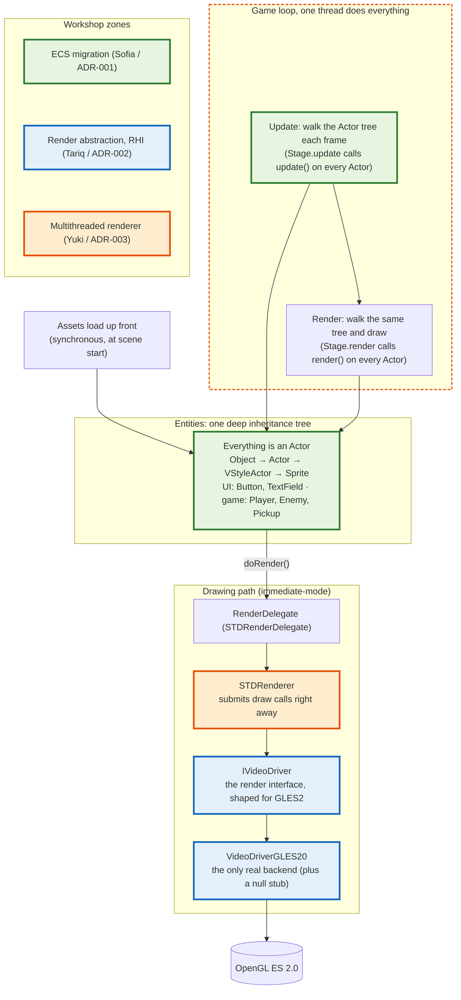

# Current Architecture (Oxygine engine)

Detailed view of the current engine. The three highlighted zones are what the workshop's three features would change; everything else stays as is.

- 🟢 **green** = entity model the ECS migration replaces (Sofia / ADR-001)
- 🔵 **blue** = render seam the RHI abstraction reshapes (Tariq / ADR-002)
- 🟠 **orange** = single-thread + immediate-mode submission the multithreading targets (Yuki / ADR-003)

